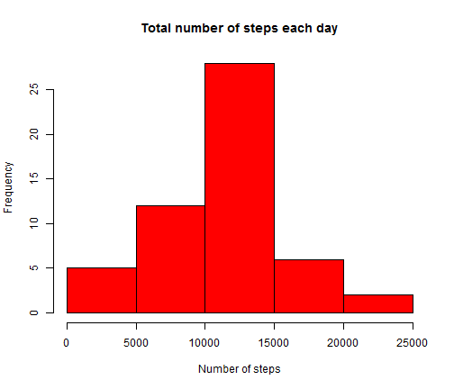
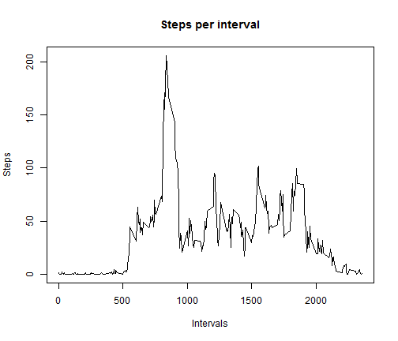
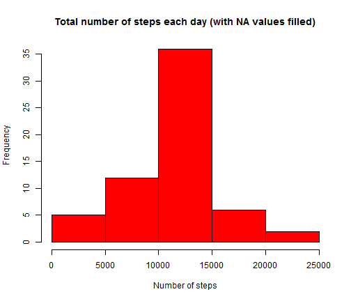
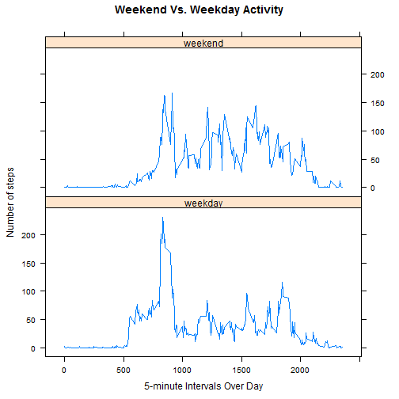

# Reproducible Research: Peer Assessment 1
========================================================


## Loading and preprocessing the data


```r
# Load and process data Ensure your working directory is set to be the
# parent of the path specified below
data <- read.csv("activity.csv", header = TRUE, sep = ",")

# Combine date and interval (time)
data$dateTime <- strptime(paste(data$date, sprintf("%04d", data$interval)), 
    format = "%Y-%m-%d %H%M")

# Prevents results from being printed in scientific notation
options(scipen = 1, digits = 2)
```


## What is mean total number of steps taken per day?


```r
# Steps per day
stepspd <- tapply(data$steps, data$date, sum)

hist(x = stepspd, xlab = "Number of steps", col = "red", main = "Total number of steps each day")
```

 


- Mean steps per day: 

```r
mean(stepspd, na.rm = TRUE)
```

```
## [1] 10766
```

- Median steps per day: 

```r
median(stepspd, na.rm = TRUE)
```

```
## [1] 10765
```


## What is the average daily activity pattern?


```r
# Steps per interval
stepspi <- tapply(data$steps, data$interval, mean, na.rm = TRUE)

plot(x = names(stepspi), y = stepspi, type = "l", xlab = "Intervals", ylab = "Steps", 
    main = "Steps per interval")
```

 


- Interval with maximum number of steps: 


```r
names(which.max(stepspi))
```

```
## [1] "835"
```


## Imputing missing values

- Total number of missing values:

```r
sum(is.na(data))
```

```
## [1] 2304
```


New data set with missing values filled in by using the average number of steps taken during this interval on other days:


```r
# Duplicate data in new variable
filledData <- data

# Get NAs
nas <- which(is.na(data$steps), arr.ind = TRUE)

# Fills NAs with average steps for that interval from the steps per interval
# variable.
filledData[nas, "steps"] <- stepspi[as.character(data[nas, "interval"])]

# Recalculate average number of steps per day with filled NAs
stepspd2 <- tapply(filledData$steps, filledData$date, sum)

hist(x = stepspd2, xlab = "Number of steps", col = "red", main = "Total number of steps each day (with NA values filled)")
```

 


- Mean steps per day: 

```r
mean(stepspd2, na.rm = TRUE)
```

```
## [1] 10766
```

- Median steps per day: 

```r
median(stepspd2, na.rm = TRUE)
```

```
## [1] 10766
```


The recalculated histogram shows a greater concentration of days in the 10,000 to 15,000 steps range. The mean and median were slightly affected.

## Are there differences in activity patterns between weekdays and weekends?


```r
filledData$date <- as.Date(filledData$date)
weekend <- c("Saturday", "Sunday")
filledData$day_type <- as.factor(sapply(filledData$date, function(x) ifelse(weekdays(x) %in% 
    weekend, "weekend", "weekday")))

library(plyr)
aveSteps <- ddply(filledData, .(interval, day_type), summarize, steps = mean(steps))

library(lattice)
xyplot(steps ~ interval | day_type, data = aveSteps, layout = c(1, 2), type = "l", 
    xlab = "5-minute Intervals Over Day", ylab = "Number of steps", main = "Weekend Vs. Weekday Activity")
```

 

